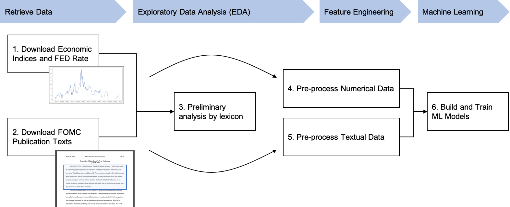

# nlpfullarabic — لغة البنك المركزي: بناء سلسلة معالجة لغة طبيعية للتنبؤ بقرارات السياسة النقدية

> سلسلة تحليل نصّي كاملة لوثائق اللجنة الفدرالية للسوق المفتوحة (FOMC): من سحب
> الوثائق من الموقع الرسمي، إلى المعالجة المسبقة وهندسة الخصائص، إلى نماذج تعلّم
> الآلة والتعلّم العميق التي تتنبّأ بقرار سعر الفائدة في الاجتماع الموالي.

**إعداد: د. مروان رودان**

🔗 [github.com/merwanroudane](https://github.com/merwanroudane)

---

## فهرس المحتويات

1. [وصف المشروع](#1-وصف-المشروع)
2. [البدء والتنصيب](#2-البدء-والتنصيب)
3. [فهم البيانات](#3-فهم-البيانات)
4. [وصف الشيفرة](#4-وصف-الشيفرة)
5. [مسرد المصطلحات](#5-مسرد-المصطلحات-العربية--الإنجليزية)
6. [بيئة العمل والمكتبات](#6-بيئة-العمل-والمكتبات)
7. [الرخصة والإسناد](#7-الرخصة-والإسناد)

---

## 1. وصف المشروع

تعقد اللجنة الفدرالية للسوق المفتوحة (Federal Open Market Committee — FOMC) ثمانية
اجتماعات دورية سنويًّا لتحديد السياسة النقدية (Monetary Policy) في الولايات المتحدة.
وفي كلّ اجتماع تنشر اللجنة بيانًا رسميًّا (Statement)، ومحضرًا (Minutes)، ونصًّا حرفيًّا
للمؤتمر الصحفي (Press Conference Transcript). كما تُنشر على موقعها خطابات الأعضاء
(Speeches) وشهاداتهم أمام الكونغرس (Testimonies).

الهدف من هذا المشروع هو تطبيق **معالجة اللغة الطبيعية (Natural Language Processing — NLP)**
على هذه النصوص لاستخلاص خصائص كامنة (Latent Features) تسمح بالتنبؤ بقرار سعر الفائدة
في الاجتماع الموالي، وهو قرار ثلاثي الفئات:

| الفئة | الرمز | English |
|---|---|---|
| رفع سعر الفائدة | `+1` | Raise / Hike |
| تثبيت سعر الفائدة | `0` | Hold / Keep |
| تخفيض سعر الفائدة | `-1` | Lower / Cut |

ويتدرّج التحليل في ثلاث مراحل:

1. تطبيق **تعلّم الآلة (Machine Learning)** على المؤشرات الاقتصادية وحدها، لقياس
   الأداء المرجعي (Baseline).
2. إضافة **البيانات النصية المعالَجة مسبقًا** كخصائص إضافية، لمعرفة ما إذا كانت تحمل
   معلومة ذات معنى.
3. تطبيق تقنيات **التعلّم العميق (Deep Learning)**: الشبكات العصبية التكرارية
   (LSTM/RNN) ونموذج 'BERT'.

جميع البيانات المستخدمة متاحة للعموم.



---

## 2. البدء والتنصيب

### المتطلّبات

- بايثون 3.11 أو أحدث
- على نظام macOS: `brew install libomp` (لازم لمكتبة 'XGBoost')

### التنصيب

```bash
python -m venv .venv
.venv\Scripts\activate
pip install -r src/requirements.txt
```

على لينكس أو macOS يكون تنشيط البيئة الافتراضية:

```bash
source .venv/bin/activate
```

ثم تنزيل بيانات مكتبة 'nltk' اللازمة للدفاتر 1 و6 و7:

```bash
python -c "import nltk; nltk.download('punkt'); nltk.download('punkt_tab'); nltk.download('stopwords')"
```

> **بديل باستخدام 'conda':**
> ```bash
> conda create -n fomc python=3.11 jupyter
> conda activate fomc
> pip install -r src/requirements.txt
> ```

### تنزيل بيانات الإدخال

> ⚠️ **تنبيه مهمّ:** هذا المستودع لا يتضمّن أيّ بيانات. يجب جلب البيانات أوّلًا قبل
> تنفيذ أيّ دفتر.

**أولًا:** إنشاء هيكل مجلّدات البيانات:

```bash
cd data
mkdir -p FOMC/statement FOMC/minutes FOMC/presconf_script FOMC/meeting_script FOMC/speech FOMC/testimony MarketData/Quandl LoughranMcDonald GloVe preprocessed train_data result models
cd ..
```

**ثانيًا:** سحب البيانات النصية من موقع اللجنة، بتحديد نوع الوثيقة وسنة البداية:

```bash
cd src
python FomcGetData.py all 1980
python FomcGetCalendar.py 1980
```

**ثالثًا:** تنزيل البيانات الاقتصادية من قاعدة FRED التابعة لبنك الاحتياطي الفدرالي في
سانت لويس (https://fred.stlouisfed.org/) بصيغة csv، ووضعها في `data/MarketData/Quandl/`:

| الملف | السلسلة | الدورية |
|---|---|---|
| `FRED_DFEDTAR.csv` | سعر الفائدة الفدرالي المستهدف قبل 2008 — Federal Funds Target Rate | يومية |
| `FRED_DFEDTARU.csv` | الحدّ الأعلى للنطاق المستهدف بعد 2008 — Target Rate Upper | يومية |
| `FRED_DFEDTARL.csv` | الحدّ الأدنى للنطاق المستهدف بعد 2008 — Target Rate Lower | يومية |
| `FRED_DFF.csv` | سعر الفائدة الفدرالي الفعلي — Effective Federal Funds Rate | يومية |
| `FRED_GDPC1.csv` | الناتج المحلي الإجمالي الحقيقي — Real GDP | فصلية |
| `FRED_GDPPOT.csv` | الناتج المحلي الإجمالي الكامن — Real Potential GDP | فصلية |
| `FRED_PCEPILFE.csv` | مؤشّر نفقات الاستهلاك الشخصي الأساسي — Core PCE | شهرية |
| `FRED_CPIAUCSL.csv` | مؤشّر أسعار المستهلك — CPI | شهرية |
| `FRED_UNRATE.csv` | معدّل البطالة — Unemployment Rate | شهرية |
| `FRED_PAYEMS.csv` | التشغيل غير الزراعي الإجمالي — Total Nonfarm Employment | شهرية |
| `FRED_RRSFS.csv` | مبيعات التجزئة المُسبقة — Advance Retail Sales | شهرية |
| `FRED_HSN1F.csv` | مبيعات المنازل الجديدة — New Home Sales | شهرية |
| `ISM_MAN_PMI.csv` | مؤشّر مديري المشتريات الصناعي — ISM Manufacturing PMI | شهرية |
| `ISM_NONMAN_NMI.csv` | المؤشّر غير الصناعي — ISM Non-Manufacturing Index | شهرية |

**رابعًا:** تنزيل قائمة كلمات المشاعر لـ لوغران وماكدونالد
(Loughran-McDonald Sentiment Word List) من https://sraf.nd.edu/textual-analysis/resources/
ووضعها في `data/LoughranMcDonald/`.

**خامسًا:** تنزيل متّجهات الكلمات 'GloVe' (المستخدمة في الدفتر 6) من
https://nlp.stanford.edu/projects/glove/، ووضع الملفّين `glove.6B.50d.txt` و
`glove.6B.100d.txt` في `data/GloVe/`.

### تنفيذ الدفاتر

```bash
jupyter notebook
```

تُفتَح الدفاتر من **1 إلى 8 بالترتيب**، لأنّ كلّ دفتر يقرأ مُخرَجات الدفتر الذي قبله.

| الدفتر | الوصف | الزمن التقديري |
|---|---|---|
| `1_FOMC_Analysis_Preliminary.ipynb` | تحليل مشاعر البيانات الرسمية بالمعجم | أقلّ من دقيقة |
| `2_FOMC_Analysis_Preprocess_NonText.ipynb` | المعالجة المسبقة للبيانات الاقتصادية | أقلّ من دقيقة |
| `3_FOMC_Analysis_Preprocess_Text.ipynb` | المعالجة المسبقة للبيانات النصية | 2–5 دقائق |
| `4_FOMC_Analysis_EDA_FE_NonText.ipynb` | التحليل الاستكشافي وهندسة الخصائص | أقلّ من دقيقة |
| `5_FOMC_Analysis_Baseline.ipynb` | النماذج المرجعية ('scikit-learn' و'XGBoost') | 10–30 دقيقة |
| `6_FOMC_Analysis_Model_Train.ipynb` | تدريب نماذج LSTM و'BERT' | ساعات (يُنصح بوحدة معالجة رسومية) |
| `7_FOMC_Analysis_By_Sentence.ipynb` | تقييم المشاعر على مستوى الجملة بـ 'BERT' | ساعات (يُنصح بوحدة معالجة رسومية) |
| `8_FOMC_Analysis_Summary.ipynb` | الرسوم التركيبية والنتائج النهائية | أقلّ من دقيقة |

> **ملاحظة عن وحدة المعالجة الرسومية:** الدفتران 6 و7 يدرّبان نماذج تعلّم عميق؛ وعلى
> وحدة المعالجة المركزية (CPU) قد يستغرق ذلك عدّة ساعات، لذا يُنصح بوحدة معالجة رسومية
> متوافقة مع 'CUDA'.
>
> **بيئة 'Google Colab':** جميع الدفاتر تعمل على 'Colab'؛ يكفي رفعها مع البيانات إلى
> 'Google Drive' وضبط `IN_COLAB = True` في أعلى كلّ دفتر.

### الدفتر 7 — نموذج 'BERT' المُدرَّب مسبقًا

يستخدم الدفتر 7 نموذج 'BERT' مضبوطًا على مجموعة `FinancialPhraseBank`. أوزان هذا
النموذج (نحو 438 ميغابايت) **غير مُرفَقة بهذا المستودع** بسبب حجمها. وعند غياب الملفّ
يعود الدفتر تلقائيًّا إلى استخدام أوزان `bert-base-uncased` الأساسية، وهو ما يُغيّر
النتائج المتوقّعة.

---

## 3. فهم البيانات

البيانات النصية مسحوبة من موقع اللجنة الفدرالية للسوق المفتوحة، والبيانات الاقتصادية
من قاعدة FRED. **ولا تتضمّن بيانات أيّ تنبؤ إلّا المعلومات المتاحة قبل تاريخ الاجتماع**،
حفاظًا على سلامة التحليل الزمني ومنعًا لتسرّب المعلومة المستقبلية (Look-ahead Bias).

### البيانات النصية

| الملف | الوصف |
|---|---|
| `FOMC/fomc_calendar.pickle` | كل تواريخ اجتماعات اللجنة |
| `FOMC/statement.pickle` | نصّ البيان الرسمي مع التاريخ والمتحدّث والعنوان. يتضمّن قرار سعر الفائدة والسعر المستهدف. ومنذ 2008 أصبح المستهدف نطاقًا لا قيمة واحدة. |
| `FOMC/minutes.pickle` | نصّ المحضر، مُنظَّم في أقسام، ويُنشَر ثلاثة أسابيع بعد كلّ اجتماع. |
| `FOMC/presconf_script.pickle` | نصّ المؤتمر الصحفي، متاح من 2011، مُصفّى على كلام رئيس المجلس فقط. |
| `FOMC/meeting_script.pickle` | النصّ الحرفي الكامل للاجتماع، يُنشَر بعد خمس سنوات — **غير قابل للاستخدام في التنبؤ الآني**. |
| `FOMC/speech.pickle` | نصّ خطابات رئيس المجلس. |
| `FOMC/testimony.pickle` | نصّ شهادات رئيس المجلس أمام الكونغرس. |

### بيانات السوق

توجد في `MarketData/Quandl/` وتُسمّى برمز السلسلة في قاعدة FRED؛ انظر الجدول في قسم
[تنزيل بيانات الإدخال](#تنزيل-بيانات-الإدخال).

### معجم لوغران وماكدونالد

`LoughranMcDonald/LoughranMcDonald_SentimentWordLists_2018.csv` — يُستخدَم في التحليل
الأوّلي وفي بناء متّجهات خصائص المشاعر بطريقة TF-IDF.

---

## 4. وصف الشيفرة

### `1_FOMC_Analysis_Preliminary.ipynb`

**الإدخال:** `FOMC/statement.pickle` وملفات سعر الفائدة الفدرالي
**الإخراج:** رسوم فقط
**الخطوات:**
1. تحليل مشاعر البيان الرسمي بقائمة كلمات لوغران وماكدونالد
2. رسم أعداد الكلمات الإيجابية والسلبية وصافي المشاعر عبر الزمن
3. ربط سعر الفائدة وقرارات السعر بتاريخ كلّ بيان
4. تركيب المتوسط المتحرك للمشاعر مع سعر الفائدة وفترات الكساد
5. التعليق على أحداث التيسير الكمّي وفترات رؤساء المجلس

### `2_FOMC_Analysis_Preprocess_NonText.ipynb`

**الإدخال:** `FOMC/fomc_calendar.pickle` وكل ملفات بيانات السوق
**الإخراج:** `preprocessed/nontext_data` و`nontext_ma2/3/6/12` و`treasury` و`fomc_calendar`
**الخطوات:**
1. تحميل ورسم كل المؤشرات الاقتصادية الرقمية
2. إضافة سعر الفائدة وقرارات السعر إلى رزنامة الاجتماعات
3. اعتبار إعلانات التيسير الكمّي أحداث تخفيض، والتقليص أحداث رفع
4. إلحاق أحدث المؤشرات الاقتصادية المتاحة بتاريخ كلّ اجتماع
5. حساب صيغ قاعدة تايلور
6. حساب المتوسطات المتحركة

### `3_FOMC_Analysis_Preprocess_Text.ipynb`

**الإدخال:** `fomc_calendar.pickle` وكل ملفات النصوص
**الإخراج:** `preprocessed/text_no_split` و`text_split_200` و`text_keyword`
**الخطوات:**
1. إضافة إعلان التيسير الكمّي إلى متن البيانات الرسمية
2. إلحاق تسميات السعر والقرار بكلّ وثيقة
3. إضافة عدد الكلمات وتاريخ الاجتماع الموالي وسعره وقراره
4. تنظيف النصّ من علامات الأقسام ورموز نهاية الأسطر
5. تقسيم الوثائق الطويلة إلى نوافذ من 200 كلمة بتداخل 50 كلمة
6. التصفية على الفقرات التي تتضمّن كلمات السياسة المفتاحية (مرّتان على الأقلّ)

### `4_FOMC_Analysis_EDA_FE_NonText.ipynb`

**الإدخال:** `preprocessed/nontext_data.pickle` وملفات المتوسطات المتحركة
**الإخراج:** `train_data/nontext_train_small` و`nontext_train_large`
**الخطوات:**
1. تحليل الارتباط لتحديد الخصائص التفسيرية
2. مقارنة توزيعات الخصائص بين فئات قرار السعر
3. تعويض القيم المفقودة
4. بناء مجموعة مصغّرة (9 خصائص مختارة) وأخرى كاملة

### `5_FOMC_Analysis_Baseline.ipynb`

**الإدخال:** `train_data/nontext_train_small.pickle`
**الإخراج:** `result/result_scores` و`baseline_predictions` و`training_data`
**الخطوات:**
1. موازنة الفئات (تثبيت / رفع / تخفيض)
2. تقسيم التدريب والاختبار بـ `shuffle=False` للحفاظ على الترتيب الزمني
3. مقارنة 14 مصنّفًا بالتحقّق المتقاطع الطبقي
4. البحث عن المعاملات الفائقة (عشوائي وشبكي) لخمسة مصنّفات
5. تحليل أهمية الخصائص
6. نماذج الدمج: مصنّف التصويت والتركيم بـ 'XGBoost'

### `6_FOMC_Analysis_Model_Train.ipynb`

**الإدخال:** `train_data/nontext_train_small.pickle` وملفات النصوص ومعجم لوغران وماكدونالد
**الإخراج:** ملفات النماذج المُدرَّبة
**الخطوات:**
1. دمج البيانات النصية وغير النصية واستكشاف تكرارات الكلمات
2. حساب درجات المشاعر بـ TF-IDF مقابل المعجم
3. الاختزال المعجمي والتقطيع والتمثيل المتّجهي
4. النموذج أ — خصائص تشابه جيب التمام ← الغابة العشوائية
5. النموذج ب — TF-IDF مع البيانات الوصفية ← الغابة العشوائية
6. النموذج ج — LSTM مع دمج البيانات الوصفية
7. النموذج د — تضمينات 'GloVe' مع LSTM والبيانات الوصفية
8. النموذج هـ — 'BERT' مع البيانات الوصفية

### `7_FOMC_Analysis_By_Sentence.ipynb`

**الإدخال:** `preprocessed/text_no_split.pickle` و`text_keyword.pickle` ونموذج 'BERT'
المُدرَّب و`train_data/train_df.pickle`
**الإخراج:** `train_data/fomc_sentiment_bert_*`
**الخطوات:**
1. تقسيم كلّ وثيقة إلى جُمل
2. تقييم مشاعر كلّ جملة بنموذج 'BERT' المضبوط على `FinancialPhraseBank`
3. تجميع أعداد المشاعر على مستوى الجملة لكلّ اجتماع
4. الدمج مع الخصائص غير النصية وإعادة تشغيل النماذج المرجعية

### `8_FOMC_Analysis_Summary.ipynb`

**الإدخال:** كل الملفات المعالَجة مسبقًا و`train_data/train_df.pickle` و`FOMC/statement.pickle`
**الإخراج:** رسوم تركيبية
**الخطوات:**
1. تمثيل تاريخ سعر الفائدة الفدرالي وفترات رؤساء المجلس
2. رسم المؤشرات الاقتصادية
3. تمثيل خصائص نصوص اللجنة (عدد الكلمات، توزيع أنواع الوثائق)
4. تركيب درجات المشاعر مع قرارات السعر
5. خرائط الارتباط الحرارية ومقارنة قاعدة تايلور
6. المقارنة النهائية لأداء النماذج

### الملفات المساعدة

| الملف | الوظيفة |
|---|---|
| `FomcGetData.py` | سحب كل أنواع وثائق اللجنة من الموقع |
| `FomcGetCalendar.py` | بناء ملفّ رزنامة اجتماعات اللجنة |
| `QuandlGetData.py` | (قديم) تنزيل بيانات السوق عبر واجهة 'Quandl' |
| `fomc_get_data/FomcBase.py` | الصنف الأساسي المُجرَّد لأصناف السحب |
| `fomc_get_data/FomcStatement.py` | ساحب البيانات الرسمية |
| `fomc_get_data/FomcMinutes.py` | ساحب المحاضر |
| `fomc_get_data/FomcPresConfScript.py` | ساحب نصوص المؤتمرات الصحفية |
| `fomc_get_data/FomcMeetingScript.py` | ساحب النصوص الحرفية للاجتماعات |
| `fomc_get_data/FomcSpeech.py` | ساحب الخطابات |
| `fomc_get_data/FomcTestimony.py` | ساحب الشهادات |

الدفاتر التالية استكشافية وليست جزءًا من السلسلة الرئيسية:
`FOMC_analyse_website.ipynb` و`FOMC_analyse_website_2.ipynb` و`FOMC_check_FEDRate.ipynb`
و`FOMC_Analysis_BERT_MultiSampleDropoutModel.ipynb` و`FOMC_Analysis_BERT_Tensorflow.ipynb`
و`FOMC_Post_Training_BERT.ipynb` و`FOMC_Text_Summarization.ipynb`.

---

## 5. مسرد المصطلحات (العربية — الإنجليزية)

### المصطلحات المؤسّسية والنقدية

| العربية | English |
|---|---|
| اللجنة الفدرالية للسوق المفتوحة | Federal Open Market Committee (FOMC) |
| مجلس الاحتياطي الفدرالي | Federal Reserve Board (FRB) |
| السياسة النقدية | Monetary Policy |
| سعر الفائدة المستهدف | Target Rate |
| سعر الفائدة الفعلي | Effective Rate |
| نقطة أساس | Basis Point |
| التيسير الكمّي | Quantitative Easing (QE) |
| التوجيه المستقبلي | Forward Guidance |
| قاعدة تايلور | Taylor Rule |
| قاعدة المقاربة المتوازنة | Balanced-approach Rule |
| قاعدة القصور الذاتي | Inertia Rule |
| الحدّ الأدنى الصفري | Zero Lower Bound |
| البيان الرسمي | Statement |
| المحضر | Minutes |
| النصّ الحرفي | Transcript / Script |
| الشهادة أمام الكونغرس | Testimony |
| رئيس المجلس | Chairperson |
| الناتج المحلي الإجمالي | Gross Domestic Product (GDP) |
| الناتج المحلي الإجمالي الكامن | Potential GDP |
| مؤشّر أسعار المستهلك | Consumer Price Index (CPI) |
| نفقات الاستهلاك الشخصي | Personal Consumption Expenditures (PCE) |
| معدّل البطالة | Unemployment Rate |
| مؤشّر مديري المشتريات | Purchasing Managers Index (PMI) |
| عائد سندات الخزانة | Treasury Yield |
| فترة الكساد | Recession |

### مصطلحات معالجة اللغة الطبيعية وتعلّم الآلة

| العربية | English |
|---|---|
| معالجة اللغة الطبيعية | Natural Language Processing (NLP) |
| تعلّم الآلة | Machine Learning |
| التعلّم العميق | Deep Learning |
| تحليل المشاعر | Sentiment Analysis |
| صافي المشاعر | Net Sentiment |
| المعجم | Lexicon |
| المتن اللغوي | Corpus |
| المعالجة المسبقة | Preprocessing |
| التقطيع إلى وحدات | Tokenization |
| الاختزال المعجمي | Lemmatization |
| كلمات التوقّف | Stopwords |
| حقيبة الكلمات | Bag of Words |
| تكرار المصطلح — معكوس تكرار الوثيقة | TF-IDF |
| تشابه جيب التمام | Cosine Similarity |
| التمثيل المتّجهي | Vectorization |
| تضمين الكلمات | Word Embedding |
| هندسة الخصائص | Feature Engineering |
| التحليل الاستكشافي للبيانات | Exploratory Data Analysis (EDA) |
| الارتباط | Correlation |
| المتوسط المتحرك | Moving Average |
| القيم المفقودة | Missing Values |
| تعويض القيم المفقودة | Imputation |
| الترميز الأحادي | One-Hot Encoding |
| بيانات غير متوازنة | Imbalanced Data |
| المعاينة العشوائية | Random Sampling |
| النموذج المرجعي | Baseline Model |
| المصنّف | Classifier |
| الغابة العشوائية | Random Forest |
| الأشجار العشوائية الإضافية | Extra Trees |
| التعزيز التدريجي | Gradient Boosting |
| التعزيز التكيّفي | AdaBoost |
| آلة المتّجهات الداعمة | Support Vector Machine (SVM) |
| مصنّف التصويت | Voting Classifier |
| التركيم | Stacking |
| دمج النماذج | Ensembling |
| المعاملات الفائقة | Hyperparameters |
| البحث الشبكي | Grid Search |
| التحقّق المتقاطع الطبقي | Stratified K-Fold Cross Validation |
| تنبؤات خارج الطيّة | Out-of-Fold Predictions |
| أهمية الخصائص | Feature Importance |
| مصفوفة الالتباس | Confusion Matrix |
| منحنى التعلّم | Learning Curve |
| الدقّة | Accuracy |
| مقياس F1 | F1 Score |
| الإفراط في المطابقة | Overfitting |
| الشبكة العصبية التكرارية | Recurrent Neural Network (RNN) |
| الذاكرة الطويلة قصيرة الأمد | Long Short-Term Memory (LSTM) |
| الطبقة الكثيفة | Dense Layer |
| الإسقاط العشوائي | Dropout |
| دالة الخسارة | Loss Function |
| الانتروبيا المتقاطعة | Cross Entropy |
| الانتشار العكسي | Backward Propagation |
| التدرّج | Gradient |
| انفجار التدرّج | Exploding Gradient |
| تقليم التدرّج | Gradient Clipping |
| المُحسِّن | Optimizer |
| الدفعة | Batch |
| الحلقة التدريبية | Epoch |
| الإيقاف المبكر | Early Stopping |
| المُوتر | Tensor |
| الحالة المخفية | Hidden State |
| وحدة المعالجة الرسومية | Graphics Processing Unit (GPU) |
| الخصائص الكامنة | Latent Features |
| تسرّب المعلومة المستقبلية | Look-ahead Bias |

---

## 6. بيئة العمل والمكتبات

### ملاحظات تقنية

- أسماء المتغيّرات والدوالّ والأصناف بالإنجليزية، حفاظًا على التوافق مع المكتبات
  وقابلية تشغيل الشيفرة.
- عناوين الرسوم وتسميات المحاور (`plt.title` و`ax.set_xlabel` …) بالإنجليزية، لأنّ
  مكتبة 'matplotlib' لا تصل الحروف العربية ولا تعالج اتجاه الكتابة افتراضيًّا، فتظهر
  الحروف مقطّعة ومعكوسة. ولاستخدام العربية في الرسوم يلزم تنصيب `arabic-reshaper`
  و`python-bidi` ومعالجة كلّ نصّ قبل تمريره إلى دوالّ الرسم.
- اتجاه الكتابة في الفقرات النثرية داخل الدفاتر مضبوط بوسم `<div dir="rtl">`، لتظهر
  من اليمين إلى اليسار في 'Jupyter' وعلى 'GitHub'.

### الحدّ الأدنى لإصدارات المكتبات

الشيفرة مكتوبة لبايثون 3.11، والدفاتر 1–5 و8 تُنفَّذ دون أخطاء عليه.

| المكتبة | الإصدار الأدنى | الاستخدام |
|---|---|---|
| numpy | ≥ 1.26 | العمليات العددية |
| pandas | ≥ 2.2 | أُطُر البيانات والسلاسل الزمنية |
| scipy | ≥ 1.14 | الدوالّ الإحصائية |
| scikit-learn | ≥ 1.6 | المصنّفات والتقييم |
| xgboost | ≥ 2.0 | التعزيز التدريجي والتركيم |
| scikit-plot | ≥ 0.3.7 | رسوم التقييم |
| matplotlib | ≥ 3.9 | الرسم |
| seaborn | ≥ 0.13 | الرسوم الإحصائية |
| wordcloud | ≥ 1.9 | سحابة الكلمات |
| nltk | ≥ 3.9 | التقطيع والاختزال المعجمي |
| torch | ≥ 2.6 | نماذج LSTM و'BERT' |
| transformers | ≥ 4.40 | نموذج 'BERT' والمُقطِّع |
| requests, bs4, lxml | ≥ 2.32 / ≥ 0.0.2 / ≥ 5.0 | سحب البيانات من الموقع |
| tqdm | ≥ 4.67 | أشرطة التقدّم |
| python-dateutil | ≥ 2.8 | معالجة التواريخ |

القائمة الكاملة في [src/requirements.txt](src/requirements.txt).

---

## 7. الرخصة والإسناد

هذا المشروع مُرخَّص برخصة **MIT** — انظر ملفّ [LICENSE](LICENSE).

**المؤلف:** د. مروان رودان — Dr Merwan Roudane
**المستودع:** https://github.com/merwanroudane/nlpfullarabic

### مصادر البيانات

البيانات مصدرها بنك الاحتياطي الفدرالي في سانت لويس (FRED)، ومعهد إدارة التوريد (ISM)،
والخزانة الأمريكية. ومعجم مشاعر لوغران وماكدونالد من جامعة نوتردام:
https://sraf.nd.edu/textual-analysis/resources/

> ⚠️ معجم لوغران وماكدونالد يتطلّب ترخيصًا للاستخدام التجاري؛ يُرجى مراجعة موقعهم.
